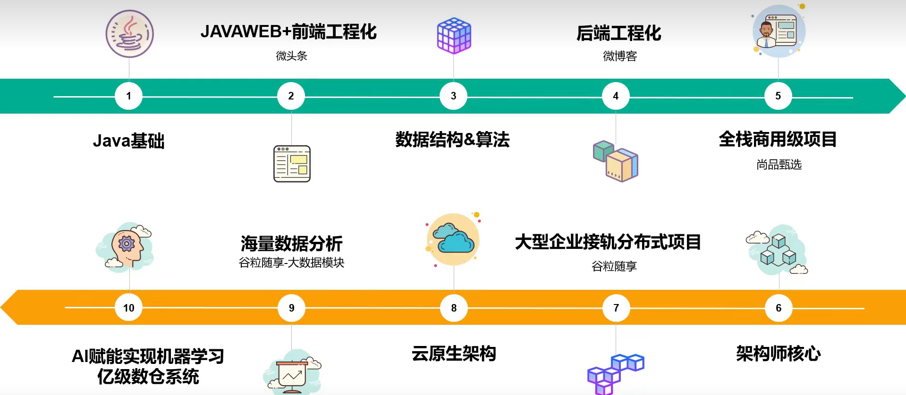

# atguigu-javaweb
尚硅谷全新JavaWeb教程，企业主流javaweb技术栈相关

## 笔记
- [第一章 概述](./01_第一章%20概述.md)
- [第二章 HTML&CSS](./02_第二章%20HTML&CSS.md)
- [第三章 JavaScript](./03_第三章%20JavaScript.md)
- [第四章 XML_Tomcat_HTTP](./04_第四章%20XML_Tomcat_HTTP.md)
- [第五章 Servlet](./05_第五章%20Servlet.md)
- [第六章 会话_过滤器_监听器](./06_第六章%20会话_过滤器_监听器.md)
- [第七章 前端工程化](./07_第七章%20前端工程化.md)
- [第八章 微头条项目开发](./08_第八章%20微头条项目开发.md)
